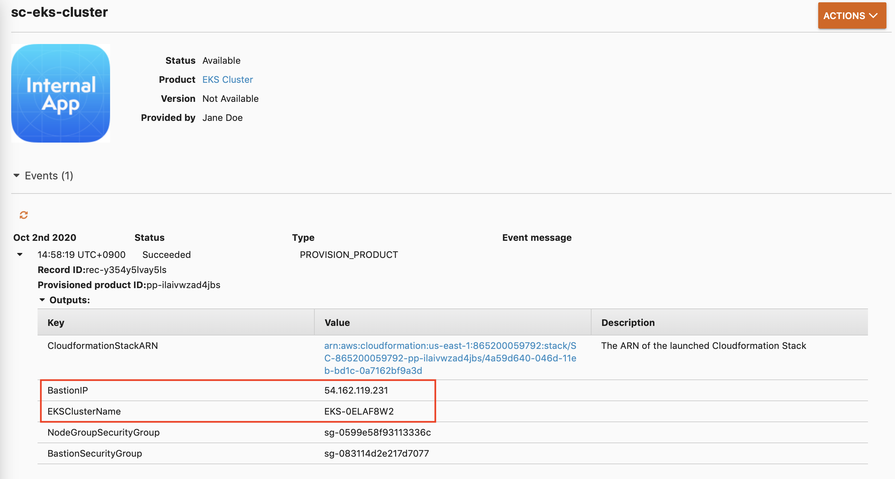

# AWS Service Catalog EKS Reference Architecture


## Installation

1. Deploy a CustomResource to provision Helm Charts

    ```
    aws cloudformation create-stack \
    --stack-name awsqs-kubernetes-helm-resource \
    --capabilities CAPABILITY_NAMED_IAM \
    --template-url https://s3.amazonaws.com/aws-quickstart/quickstart-helm-resource-provider/deploy.template.yaml 
    ```

    - If you are curiou how this works, please check out [this Quick Start repository](https://github.com/aws-quickstart/quickstart-helm-resource-provider).


2. Make sure you have all the prerequisites to run cdk application. It includes having Node.js, aws cli, credential settings and cdk cli. You can find the details from [this document](https://docs.aws.amazon.com/cdk/latest/guide/getting_started.html#getting_started_prerequisites).

3. Clone this repository and deploy 

    ```
    git clone <THIS_REPOSITORY>
    cd <THIS_REPOSITORY_DIR>
    npm i && npm run build

    ACCOUNT_ID=$(aws sts get-caller-identity|jq -r ".Account")
    cdk bootstrap aws://$ACCOUNT_ID/us-east-1
    cdk deploy --require-approval never
    ```

4. When the cdk application is successfully deployed, you will find an ARN of IAM Role which you would assume to test Service Catalog Portfolio.
    

5. Use the output to assume the role. When you click your login information in upper right corner, you will see find **Swith Role**. Once you click it, you will see the following console to supply the information of the IAM Role you are trying to assume.

    


6. When you successfully assumed the role, go to [AWS Service Catalog console](https://console.aws.amazon.com/servicecatalog/home?region=us-east-1&isSceuc=true#/home) where you will see the following products ready for you. Click **EKS Cluster** to provision the cluster first. Once you do it, you will see the Product details page. Click **Launch Product** button.

    

    

7. Specify the name of the product that you are trying to deploy. Then click `Next`.

    

8. You will see the options you can customize for your EKS cluster. Once you checked all the settings, please proceed by clicking **Next** until you finally see **Launch**.


    Every settings, except two, have default value. You may leave those as they are now when you test, or change any of them as you wish. Other than that, there are two things that you are required to provide.

    - For **Allowed external access CIDR** type `0.0.0.0/0` for convenience of the test. In production environment, please make sure it falls into your organization's security policy.

    - If you want to provison a bastion host, make sure **Provison bastion host** `Enabled` and specify **SSH key name**. If you do not have one, please create one [here](https://console.aws.amazon.com/ec2/v2/home?region=us-east-1#CreateKeyPair:).

9. When you click **Launch**, you will see the Provisioned product details. You can check out the progress when you click the CloudformationStackARN.

    

    This will take a while. Please give yourself a coffee break. When it is provisioned, the product result will be printed out.

    

10. Want to check out provisioned EKS cluster? Log into the bastion host using the IP address in the ouput section. Use the ssh key you specified. You will be able to see the result as following screenshot, when you run `kubectl get node`.
    

11. Next, let's see how we can deploy Container resources over the cluster using Helm Charts. Go back to the Product list, then click **WordPress on EKS cluster**. When you see the Product detail page, click **Launch Product** button.

12. Type the **product name** you will provision, and click Next. Once you hit Next, you will be asked to type the **EKS cluster's name** where your WordPress should be located. Keep clicking **Next** until you see Launch button, and finally click **Launch**.